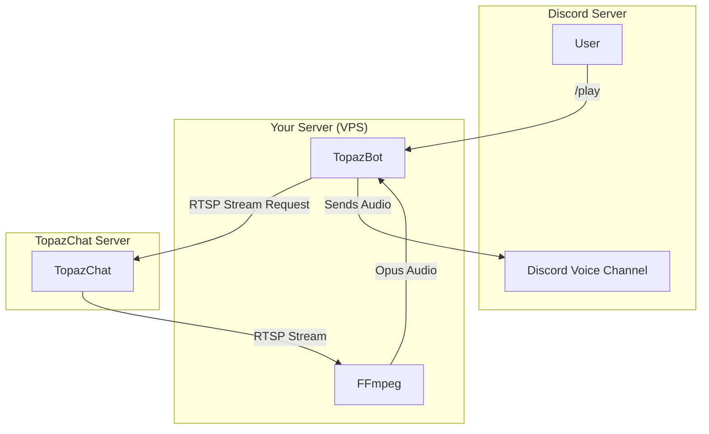

#  TopazBot - RTSP Discord Music bot for TopazChat

[](https://github.com/emerauda/TopazBot/actions/workflows/lint.yml)
[](https://github.com/emerauda/TopazBot/actions/workflows/node.js.yml)
[](https://circleci.com/gh/emerauda/TopazBot/tree/main)
[](https://codecov.io/gh/emerauda/TopazBot)
[](https://www.typescriptlang.org/)
[](https://nodejs.org/)
[](https://discord.com/)
[](https://opensource.org/licenses/MIT)


[English README](./README.md)

---

## 🌟 概要

**TopazBot**は、TopazChatのRTSPストリームを利用した高音質で低遅延なDiscordミュージックボットです。Linux等のサーバーで動作し、ストリーム音声をDiscordサーバーに提供します。

**注意!!**

_「TopazBot」はMITライセンス下にありますが、「TopazChat」は商用利用禁止です。_

### ✨ 主な機能

- 🧠 **高品質**: ステレオで高音質で低遅延なストリーム再生
- 🔒 **セキュア**: DAVE (Discord Audio Video Encryption) によるエンドツーエンド暗号化音声
- 🌐 **多フォーマット対応**: ffmpegで柔軟なストリーム処理

---

## 💎 TopazChatについて

### 📝 詳細

[TopazChat](https://github.com/TopazChat/TopazChat)は、高品質・低遅延のRTSPサーバです。個人での利用は無料です。

[TopazChat ダウンロード](https://booth.pm/ja/items/1752066)

TopazChatの費用は、開発者のよしたかさん[@TyounanMOTI](https://github.com/TyounanMOTI)が負担しています。

サーバーの維持費や音声・動画配信のデータ転送料のために寄付をお願いします！→[FANBOX](https://tyounanmoti.fanbox.cc/)

TopazChatのすべてのスポンサーは、SPONSORS.txtに記載されています。

### 💬 コミュニティ

- TopazChat Discord Server

join: https://discord.com/invite/fCMcJ8A

---

## 🚀 クイックスタート

TopazBotを導入するには、2つの方法があります。

### 1. 公開Botを利用する

一番簡単な方法です。以下のリンクからあなたのDiscordサーバーにBotを追加できます。

[ここをクリックしてBotを導入](https://discord.com/oauth2/authorize?client_id=876143776572248074)

### 2. セルフホストで利用する

ご自身でサーバーを用意して、Botを運用する方法です。

#### 📋 前提条件

- Linux サーバー
- FFmpeg (RTSP対応版)
- Node.js 22.x
- npm または yarn
- Discord Bot Token
- TopazChatストリーム

#### 📦 依存関係

このライブラリは、さまざまなプラットフォームをサポートするために、以下のカテゴリーからそれぞれ1つずつインストールしてください。

依存関係は、パフォーマンスが優先される順に記載されています。

オプションの1つがインストールできない場合は、別のオプションをインストールしてみてください。

##### 🐧 Debian or Ubuntu

**node & npm:**

- `node`: >=22
- `npm`: >=10

**discord.js (npm install)**

- `discord.js`: ^14.26.5

**@discordjs/voice (npm install):**

- `@discordjs/voice`: ^0.19.2

**@discordjs/opus (npm install):**

- `@discordjs/opus`: "^0.10.0"

**DAVE暗号化 (npm install):**

- `@snazzah/davey`: ^0.1.12

**Encryption Libraries (npm install):**

- `sodium-native`: ^5.1.0

**Opus Libraries (npm install):**

- `@discordjs/opus`: ^0.10.0

**FFmpeg:**

- [`FFmpeg`](https://ffmpeg.org/) (apt install ffmpeg等でサーバーにインストールして下さい)

**pm2 (npm install): [オプション]**

- `pm2`

#### 🛠️ インストール

```bash
# リポジトリをクローン
git clone https://github.com/emerauda/TopazBot.git topazbot
cd topazbot

# 依存関係をインストール
npm install

# 環境変数を設定
cp .env.example .env
# .envファイルを編集して必要な環境変数を設定
```

#### ⚙️ 設定

`.env`ファイルに以下の環境変数を設定：

```env
# Discord Bot設定
DISCORD_TOKEN=your_discord_bot_token

# RTSPサーバー設定（オプション）
# デフォルト: rtsp://topaz.chat/live
RTSP_SERVER_URL=rtsp://topaz.chat/live
```

**設定オプション:**

| 変数 | 必須 | デフォルト | 説明 |
| --- | --- | --- | --- |
| `DISCORD_TOKEN` | Yes | - | Discordボットトークン |
| `RTSP_SERVER_URL` | No | `rtsp://topaz.chat/live` | RTSPサーバーのベースURL |
| `USE_EXTERNAL_OPUS` | No | `1` | `1` = OggOpus出力（推奨）、`0` = AAC ADTSフォールバック |
| `INPUT_IS_OPUS` | No | `0` | `1` = 入力が本当にOpusの場合のみ無変換コピー（TopazChatはAACなので `0` のまま。誤設定時は自動フォールバック） |
| `FORCE_OPUS_REENCODE` | No | `0` | `1` = `INPUT_IS_OPUS=1`でも強制的にlibopusで再エンコード |
| `LOW_LATENCY` | No | `0` | `1` = 低遅延FFmpegフラグを有効化 (nobuffer, analyzeduration=0) |
| `OPUS_BITRATE` | No | `192k` | Opusビットレート |
| `AAC_BITRATE` | No | `OPUS_BITRATE` | AACフォールバック時のビットレート (`USE_EXTERNAL_OPUS=0`) |
| `CHANNEL_FIX_MODE` | No | `none` | `none` / `swap` / `left` / `right` / `mix`（再エンコード時のみ有効） |
| `DOWNMIX_MONO` | No | `0` | `1` = 入力をモノラルにダウンミックス（`-ac 1`、再エンコード時のみ有効） |
| `COPY_WITH_DISCARDCORRUPT` | No | `0` | `1` = copyモードでも破損フレーム破棄/PTS再生成を行う |
| `PLAY_WAIT_MS` | No | `2000` / `300` | 再生開始後の安定化待機時間（低遅延時の既定: 300） |
| `RESUME_WAIT_MS` | No | `3000` / `500` | 自動再開（リトライ）前の待機時間（低遅延時の既定: 500） |
| `DEBUG_FFMPEG` | No | `0` | `1` = FFmpegの起動引数とstderrをログ出力 |

ボットを使用する際、ストリームは `${RTSP_SERVER_URL}/${streamkey}` としてアクセスされます。

#### 🚀 デプロイ

```bash
# ビルド
npm run build

# スタート
npm run start

# コマンド登録
npm run register

# pm2を使ってプログラムスタート
npm i pm2 -g
pm2 start npm -n TopazBot -- start

```

---

## 🎮 コマンド一覧

TopazBotは以下のスラッシュコマンドに対応しています。

### ▶️ `/play`

- **説明**: 指定されたストリームキーを使用して、TopazChatからのRTSPストリームを再生します。
- **使い方**: `/play StreamKey: <あなたのストリームキー>`
- **パラメータ**:
  - `StreamKey` (必須): TopazChatのストリームキー。

### 🔄 `/resync`

- **説明**: 接続が不安定な場合や、ストリームが途切れた際に再接続を試みます。
- **使い方**: `/resync` または `/resync StreamKey: <あなたのストリームキー>`
- **パラメータ**:
  - `StreamKey` (任意): 再同期するストリームキー。省略時は直前に再生したものを使用。

### ⏹️ `/stop`

- **説明**: 現在のストリーム再生を停止し、ボイスチャンネルから切断します。
- **使い方**: `/stop`

### 🎚️ 再生の挙動

- **自動再開**: 配信が中断しても（配信者の再起動など）、ボットは接続を維持し、ストリーム復帰時に自動で再生を再開します。
- **自動切断**: 再生が30分間成功しない場合（配信者が戻らない等）、自動でボイスチャンネルから退出します。正常に再生が続いている限り切断されることはありません。
- **ストリーム切替**: 再生中に別のストリームキーで `/play` を実行すると、新しいストリームに切り替わります。
- **失敗時の挙動**: 初回の再生に失敗した場合は、エラーを報告してボイスチャンネルから退出します。
- **グレースフルシャットダウン**: SIGINT/SIGTERM（`pm2 stop`/`pm2 restart` など）で全セッションを後始末してから終了します。FFmpegプロセスや接続は残りません。

## 📜 利用規約とプライバシーポリシー

- **[利用規約](https://emerauda.github.io/TopazBot/terms/)**
- **[プライバシーポリシー](https://emerauda.github.io/TopazBot/privacy/)**

---

## 🏗️ アーキテクチャ



### 🔧 技術スタック

| カテゴリ           | 技術             | バージョン |
| :----------------- | :--------------- | :--------- |
| **言語**           | TypeScript       | ^6.0.3     |
| **ランタイム**     | Node.js          | >=22.x     |
| **フレームワーク** | discord.js       | ^14.26.5   |
| **音声処理**       | @discordjs/voice | ^0.19.2    |
| **DAVE暗号化**     | @snazzah/davey   | ^0.1.12    |
| **メディア処理**   | FFmpeg           | -          |
| **RTSPサーバー**   | TopazChat        | -          |
| **Opusライブラリ** | @discordjs/opus  | ^0.10.0    |
| **暗号化**         | sodium-native    | ^5.1.0     |
| **パッケージ管理** | npm              | >=10       |
| **テスト**         | Jest             | ^30.4.2    |
| **リンター**       | ESLint           | ^10.7.0    |
| **フォーマッター** | Prettier         | ^3.9.5     |

---

## 🧪 開発

### 📝 スクリプト

| コマンド                | 説明                             |
| ----------------------- | -------------------------------- |
| `npm run build`         | TypeScriptをビルド               |
| `npm run start`         | ビルドしてBotを起動              |
| `npm run dev`           | ts-nodeで開発起動              |
| `npm run register`      | Discordスラッシュコマンドを登録 |
| `npm run lint`          | ESLintを実行                   |
| `npm run lint:fix`      | ESLint自動修正を実行             |
| `npm run format`        | Prettierフォーマットを適用       |
| `npm run format:check`  | Prettierフォーマットをチェック   |
| `npm run typecheck`     | 型チェックのみ実行 (出力なし)     |
| `npm run test`          | テストを実行                   |
| `npm run test:watch`    | テストをウォッチモードで実行   |
| `npm run test:coverage` | カバレッジ付きテストを実行     |

### 🔍 デバッグ

```bash
# ローカル開発サーバー起動
npm run dev

# テスト実行
npm test

# カバレッジレポート生成
npm run test:coverage
```

#### カバレッジレポートは [Codecov](https://codecov.io/gh/emerauda/TopazBot) で確認可能

---

## 📂 Code structure

このボットのコードはTopazChat向けに最適化されていますが、`RTSP_SERVER_URL` 環境変数で他のRTSPサーバーにも接続できます。

私が参考にしたコード [discordjs-japan/音声を再生する](https://scrapbox.io/discordjs-japan/%E9%9F%B3%E5%A3%B0%E3%82%92%E5%86%8D%E7%94%9F%E3%81%99%E3%82%8B)

[Discord.js Japan user Group](https://scrapbox.io/discordjs-japan/)

---

## 🤝 コントリビューション

オープンソースコミュニティを素晴らしい学び、創造、そしてインスピレーションの場にしてくれるのは、コントリビューションです。あなたのいかなる貢献も**心から感謝**しています。

もしこのプロジェクトをより良くする提案があれば、リポジトリをフォークしてプルリクエストを作成してください。また、"enhancement" タグを付けてIssueを立てるだけでも構いません。
プロジェクトにスターを付けるのもお忘れなく！ありがとうございます！

1.  プロジェクトをフォークする
2.  機能ブランチを作成する (`git checkout -b feature/AmazingFeature`)
3.  変更をコミットする (`git commit -m 'Add some AmazingFeature'`)
4.  ブランチにプッシュする (`git push origin feature/AmazingFeature`)
5.  プルリクエストを開く

プロセスや期待されることの詳細については、**[コントリビューションガイドライン](https://github.com/emerauda/TopazBot/blob/main/.github/CONTRIBUTING.md)**をお読みください。

---

## ❤️ 寄付

### 📻 TopazBot

公開TopazBotサーバー維持に必要なカンパをお願いしております。

- TopazBot [GitHub Sponsors](https://github.com/sponsors/ROZ-MOFUMOFU-ME?o=sd&sc=t)

### 💎 TopazChat

TopazChatのサーバー維持費やデータ転送料について、開発者のよしたかさんがカンパを募っています。

- TopazChat [FANBOX](https://tyounanmoti.fanbox.cc/)

## 🙏 クレジット

### 📻 TopazBot

- Aoi Emerauda [@emerauda](https://github.com/emerauda)

### 💎 TopazChat

- よしたか様 [@TyounanMOTI](https://github.com/TyounanMOTI) TopazChat開発者

## 📄 ライセンス

このプロジェクトは MIT ライセンスの下で公開されています。詳細は [LICENSE](LICENSE) ファイルをご覧ください。

---

## 👥 チーム

<div align="center" markdown="1">

[](https://github.com/emerauda/TopazBot/graphs/contributors)

</div>

---

## 📞 サポート

- 🐛 **バグレポート**: [Issues](https://github.com/emerauda/TopazBot/issues)
- 💡 **機能要望**: [Discussions](https://github.com/emerauda/TopazBot/discussions)
- 📧 **お問い合わせ**: [aoi@emerauda.com](mailto:aoi@emerauda.com)

---

## 🌟 スター履歴

[](https://star-history.com/#emerauda/TopazBot&Date)

---

## 📊 統計


---

<div align="center" markdown="1">

**⭐ このプロジェクトが気に入ったら、スターをお願いします！ ⭐**

[](https://github.com/emerauda/TopazBot)
[](https://github.com/emerauda/TopazBot/fork)
[](https://github.com/emerauda/TopazBot)

Made with ❤️ by [Aoi Emerauda](https://github.com/emerauda)

</div>
