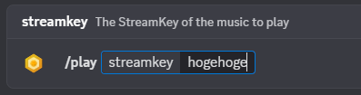

#  TopazBot - RTSP Discord Music bot for TopazChat

[](https://github.com/emerauda/TopazBot/actions/workflows/lint.yml)
[](https://github.com/emerauda/TopazBot/actions/workflows/node.js.yml)
[](https://circleci.com/gh/emerauda/TopazBot/tree/main)
[](https://codecov.io/gh/emerauda/TopazBot)
[](https://www.typescriptlang.org/)
[](https://nodejs.org/)
[](https://discord.com/)
[](https://opensource.org/licenses/MIT)



[日本語README](./README-JP.md)

---

## 🌟 Overview

**TopazBot** is a high-quality, low-latency Discord music bot that utilizes TopazChat's RTSP stream. It runs on servers like Linux and provides streamed audio to your Discord server.

**Attention!!**

_"TopazBot" is under the MIT license, but "TopazChat" is not for commercial use._

### ✨ Key Features

- 🧠 **High Quality**: Stereo, high-fidelity, low-latency stream playback.
- 🔒 **Secure**: Safe communication with Discord signature verification.
- 🌐 **Multi-format Support**: Flexible stream processing with ffmpeg.

---

## 💎 About TopazChat

### 📝 Details

[TopazChat](https://github.com/TopazChat/TopazChat) is a high-quality, low-latency RTSP server. It is free for personal use.[TopazChat Download](https://booth.pm/ja/items/1752066)
The costs for TopazChat are covered by the developer, Hirotoshi Yoshitaka [@TyounanMOTI](https://github.com/TyounanMOTI).
Please consider donating to help with server maintenance and data transfer costs for audio/video streaming! → [FANBOX](https://tyounanmoti.fanbox.cc/)
All sponsors of TopazChat are listed in SPONSORS.txt.

### 💬 Community

- TopazChat Discord Server

Join: https://discord.com/invite/fCMcJ8A

---

## 🚀 Quick Start

There are two ways to get started with TopazBot.

### 1. Use the Public Bot

This is the easiest way. You can add the bot to your Discord server using the link below:

[Click here to add the bot](https://discord.com/oauth2/authorize?client_id=876143776572248074)

### 2. Self-Hosting

You can host the bot on your own server.

#### 📋 Prerequisites

- Linux Server
- FFmpeg (RTSP-enabled)
- Node.js 22.x
- npm or yarn
- Discord Bot Token
- TopazChat Stream

#### 📦 Dependencies

This library requires one dependency from each of the categories below to support various platforms.
The dependencies are listed in order of performance preference.
If you cannot install one of the options, try installing another.

##### 🐧 Debian or Ubuntu

**node & npm:**

- `node`: >=22
- `npm`: >=6

**discord.js (npm install)**

- `discord.js`: ^14.21.0

**@discordjs/voice (npm install):**

- `@discordjs/voice`: ^0.18.0

**@discordjs/opus (npm install):**

- `@discordjs/opus`: "^0.10.0"

**Encryption Libraries (npm install):**

- `sodium-native`: ^5.0.6

**Opus Libraries (npm install):**

- `@discordjs/opus`: ^0.10.0

**FFmpeg:**

- [`FFmpeg`](https://ffmpeg.org/) (Please install on your server, e.g., `apt install ffmpeg`)

**pm2 (npm install): [Optional]**

- `pm2`

#### 🛠️ Installation

```bash
# Clone the repository
git clone https://github.com/emerauda/TopazBot.git topazbot
cd topazbot

# Install dependencies
npm install

# Set up environment variables
cp .env.example .env
# Edit the .env file and set the required environment variables
```

#### ⚙️ Configuration

Set the following environment variable in your `.env` file:

```env
DISCORD_TOKEN=your_discord_bot_token
```

#### 🚀 Deployment

```bash
# Build
npm run build

# Start
npm run start

# Register commands
npm run register

# Start the program using pm2
npm i pm2 -g
pm2 start npm -n TopazBot -- start
```

---

## 🎮 Command List

TopazBot supports the following slash commands.

### ▶️ `/play`

- **Description**: Plays the RTSP stream from TopazChat using the specified stream key.
- **Usage**: `/play StreamKey: <your_stream_key>`
- **Parameters**:
  - `StreamKey` (required): Your TopazChat stream key.

### 🔄 `/resync`

- **Description**: Attempts to reconnect if the connection is unstable or the stream is interrupted.
- **Usage**: `/resync`

### ⏹️ `/stop`

- **Description**: Stops the current stream playback and disconnects from the voice channel.
- **Usage**: `/stop`

---

## 📜 Legal

- [Terms of Service](https://emerauda.github.io/TopazBot/terms/)
- [Privacy Policy](https://emerauda.github.io/TopazBot/privacy/)

---

## 🏗️ Architecture

<div class="mermaid">
graph TD
    subgraph "Discord Server"
        User
        DiscordVoiceChannel[Discord Voice Channel]
    end

    subgraph "Your Server (VPS)"
        TopazBot
        FFmpeg
    end

    subgraph "TopazChat Server"
        TopazChat
    end

    User -- "/play" --> TopazBot
    TopazBot -- "RTSP Stream Request" --> TopazChat
    TopazChat -- "RTSP Stream" --> FFmpeg
    FFmpeg -- "Opus Audio" --> TopazBot
    TopazBot -- "Sends Audio" --> DiscordVoiceChannel

</div>

### 🔧 Tech Stack

| Category             | Technology       | Version  |
| :------------------- | :--------------- | :------- |
| **Language**         | TypeScript       | ^5.8.3   |
| **Runtime**          | Node.js          | >=22.x   |
| **Framework**        | discord.js       | ^14.21.0 |
| **Audio Processing** | @discordjs/voice | ^0.18.0  |
| **Media Processing** | FFmpeg           | -        |
| **RTSP Server**      | TopazChat        | -        |
| **Opus Library**     | @discordjs/opus  | ^0.10.0  |
| **Encryption**       | sodium-native    | ^5.0.6   |
| **Package Manager**  | npm              | >=6      |
| **Testing**          | Jest             | ^30.0.3  |
| **Linter**           | ESLint           | ^9.30.1  |
| **Formatter**        | Prettier         | ^3.6.2   |

---

## 🧪 Development

### 📝 Scripts

| Command                 | Description               |
| ----------------------- | ------------------------- |
| `npm run build`         | Build TypeScript          |
| `npm run dev`           | Start development server  |
| `npm run register`      | Register Discord commands |
| `npm run lint`          | Run type checking         |
| `npm run lint:fix`      | Run type fixing           |
| `npm run format`        | Apply code formatting     |
| `npm run format:check`  | Check code formatting     |
| `npm run test`          | Run tests                 |
| `npm run test:watch`    | Run tests in watch mode   |
| `npm run test:coverage` | Run tests with coverage   |

### 🔍 Debugging

```bash
# Start local development server
npm run dev

# Run tests
npm test

# Generate coverage report
npm run test:coverage
# The coverage report can be viewed at [coverage](https://emerauda.github.io/TopazBot/coverage/)
```

---

## 📂 Code structure

The code for this bot is specific to TopazChat.

Here is the code I used for reference: [discordjs-japan/Playing Audio](https://scrapbox.io/discordjs-japan/%E9%9F%B3%E5%A3%B0%E3%82%92%E5%86%8D%E7%94%9F%E3%81%99%E3%82%8B) (in Japanese)

Created by [Discord.js Japan user Group](https://scrapbox.io/discordjs-japan/)

---

## 🤝 Contributing to TopazBot

Contributions are what make the open source community such an amazing place to learn, inspire, and create. Any contributions you make are **greatly appreciated**.

If you have a suggestion that would make this better, please fork the repo and create a pull request. You can also simply open an issue with the tag "enhancement".
Don't forget to give the project a star! Thanks again!

1.  Fork the Project
2.  Create your Feature Branch (`git checkout -b feature/AmazingFeature`)
3.  Commit your Changes (`git commit -m 'Add some AmazingFeature'`)
4.  Push to the Branch (`git push origin feature/AmazingFeature`)
5.  Open a Pull Request

Please read our [Contributing Guidelines](https://github.com/emerauda/TopazBot/blob/main/CONTRIBUTING.md) for more details on the process and what we expect.

---

## ❤️ Donations

### 🤖 TopazBot

Please consider donating to help maintain the public TopazBot server.

- TopazBot [GitHub Sponsors](https://github.com/sponsors/ROZ-MOFUMOFU-ME?o=sd&sc=t)

### 💬 TopazChat

The developer of TopazChat, Hirotoshi Yoshitaka, is seeking donations to cover server maintenance and data transfer costs.

- TopazChat [FANBOX](https://tyounanmoti.fanbox.cc/)

## 🙏 Credits

### 🤖 TopazBot

- Aoi Emerauda [@emerauda](https://github.com/emerauda)

### 💬 TopazChat

- Hirotoshi Yoshitaka [@TyounanMOTI](https://github.com/TyounanMOTI) TopazChat Developer

## 📄 License

This project is released under the MIT License. See the [LICENSE](LICENSE) file for details.

---

## 👥 Team

<div align="center" markdown="1">

[](https://github.com/emerauda/TopazBot/graphs/contributors)

</div>

---

## 📞 Support

- 🐛 **Bug Reports**: [Issues](https://github.com/emerauda/TopazBot/issues)
- 💡 **Feature Requests**: [Discussions](https://github.com/emerauda/TopazBot/discussions)
- 📧 **Contact**: [aoi@emerauda.com](mailto:aoi@emerauda.com)

---

## 🌟 Star History

[](https://star-history.com/#emerauda/TopazBot&Date)

---

## 📊 Statistics


---

<div align="center" markdown="1">

**⭐ If you like this project, please give it a star! ⭐**

[](https://github.com/emerauda/TopazBot)
[](https://github.com/emerauda/TopazBot/fork)
[](https://github.com/emerauda/TopazBot)

Made with ❤️ by [Aoi Emerauda](https://github.com/emerauda)

</div>
